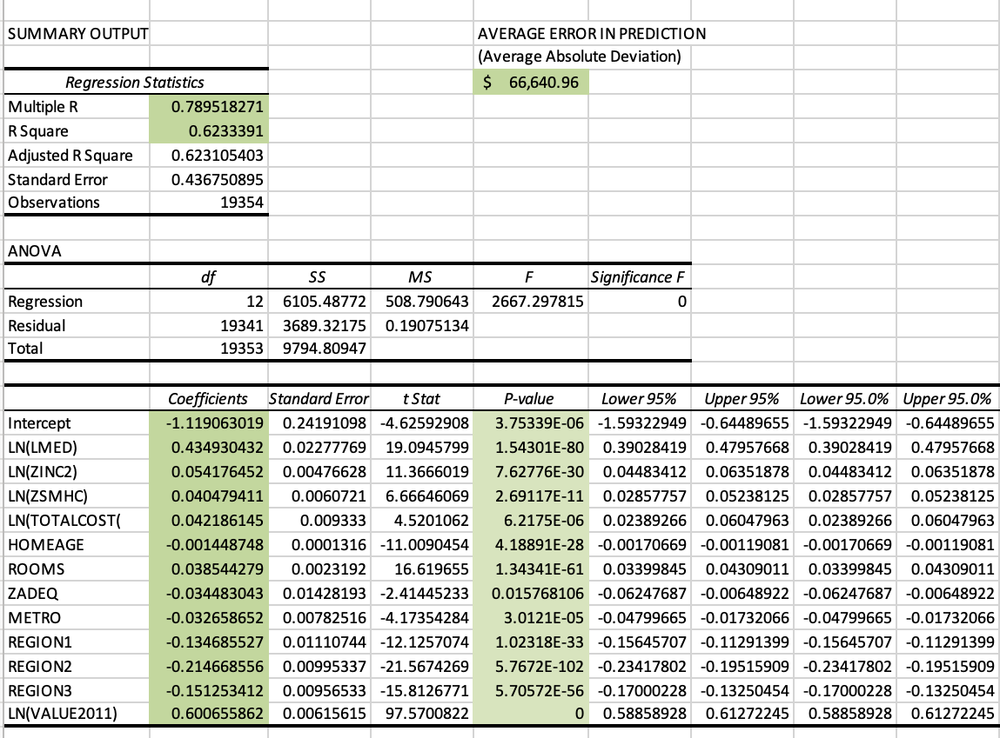

### Fair Market Value of Housing using Biennial Data: 2011-2013

#### Executive Summary

The housing market in the US saw a dramatic dip as a result of the Financial Crisis of 2008, triggered by the mass default in sub-prime mortgages. After various interventions by the US government, housing prices were picking up again by 2013. This rebound in the housing market allowed for the opportunity to explore housing prices in 2013, when the market was starting to rebound, based on conditions two years earlier in 2011, when the market was bottoming out. 

A multi-variable linear regression was performed to predict the fair market value of homes in 2013. The model found the variables from 2011 with the greaestest impact on the value of a home in 2013 were **value of the home in 2001**, **median household income of the area in which the home was located**, **living in the Western US**, and **the number of rooms in the home**. The multiple R value of the analysis was **0.79** and the adjusted R-squared value was **0.63**, indicating a relatively strong overal relationship. The model has some predictive power in biennial housing price modelling, but is limited by the structure of the model itself being only a linear regression, whereas more powerful machine learning models could make stronger predictions. 

##### Results

##### Regression Analysis 

##### Notes on Statistics 

##### Notes on the Project

The analysis was conducted for Rice University Capstone project in the online speciality for Business Statistics and Analysis. The cleaned data for the holdout set, including the predicted and acutal prices, are found in the <a href="./Data.csv">this file here</a>. Please send me a request if you would like to see the original Excel analysis files. 
